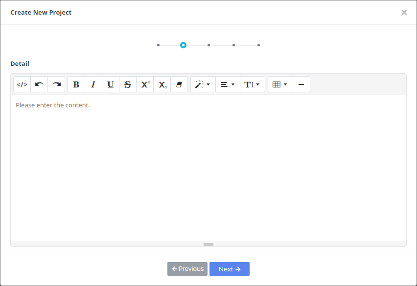
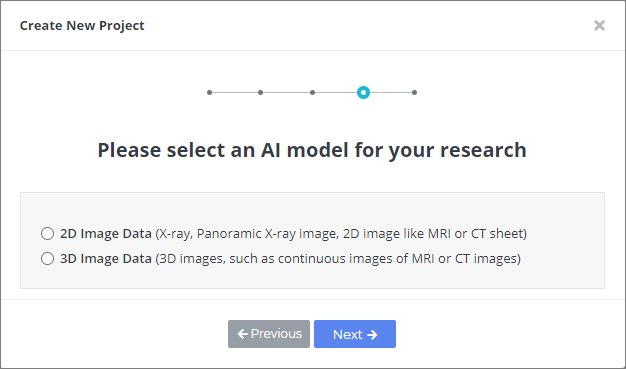

# 3. 사용 방법

***

## 3-1. 프로젝트 구성

DEEP:PHI 플랫폼에선 사용자가 프로젝트를 직접 생성해서 사용하거나, 다양한 Shared 프로젝트를 복사하여 사용할 수 있습니다.  

Shared 프로젝트는 다른 유저가 생성하여 전체 유저에게 공개한 프로젝트입니다.  
Shared 프로젝트를 복사해서 My Project로 가져온 뒤 복사된 프로젝트에서 사용자가 직접 데이터셋만 교체하거나 모듈 수정을 거쳐 사용할 수 있습니다.

### (1) Shared 프로젝트 사용하기

* Dashboard 좌측 Shared Projects 메뉴를 선택해 Shared 프로젝트 목록에 진입할 수 있습니다.  
* Shared 프로젝트 목록 중앙 상단의 파란색 영역에서 Shared 프로젝트를 이름으로 검색할 수 있습니다.  
* Shared 프로젝트 목록 우측 상단의 녹색 영역에서 신체 부위별, 정렬 기준, 한 번에 보이는 프로젝트의 개수 등을 조절하여 목록을 필터링할 수 있습니다.  
* 해당 프로젝트를 클릭하여 프로젝트 내부 구성을 확인할 수 있습니다.  
* 해당 프로젝트는 우측의 노란색 영역에 있는 `Copy to me` 버튼을 선택하여 My Project로 복사해올 수 있습니다.  
* 복사해온 Shared 프로젝트는 My Project 내에서 Copy of "Project 명"으로 생성되어 있으며 해당 프로젝트를 클릭하여 프로젝트로 진입한 뒤 편집 및 학습을 실행할 수 있습니다.

### (2) My 프로젝트 사용하기

사용자가 별도의 데이터셋을 업로드하고 직접 프로젝트 파이프라인을 만들고 싶은 경우 My Project를 생성해서 사용할 수 있습니다.  
Dashboard 좌측 My Project 메뉴를 선택한 후 중앙 좌측의 `+Create` 버튼을 누르면 프로젝트 생성 마법사가 실행되며 간단한 정보를 입력하여 생성할 수 있습니다.  

프로젝트 생성 단계는 아래와 같습니다. (*표시는 필수 입력 정보입니다.)

① 프로젝트의 이름과 업로드하려는 데이터셋의 촬영 부위, 영상의 종류, 요약 내용 등과 프로젝트 목표일을 입력합니다. My Project에서 각 프로젝트의 커버 이미지를 표시하고 싶은 경우 선택적으로 커버 이미지를 업로드하여 사용할 수 있습니다.

② 프로젝트의 연구 목적을 설명할 수 있는 상세정보를 입력합니다.

③ 프로젝트에서 사용하려는 AI 알고리즘의 종류를 선택합니다.

④ 프로젝트에 사용할 데이터셋의 차원을 선택합니다.  

* 2D 데이터셋 - Xray와 같이 순서가 존재하지 않는 낱장의 이미지들으로 이루어진 경우  
* 3D 데이터셋 - CT나 MRI처럼 환자 단위로 연속적인 하나의 볼륨이 구성되어 각 데이터간 순서가 존재하는 경우

⑤ 모든 프로젝트 설정을 완료하고 프로젝트 생성을 시작합니다.

프로젝트 생성시 입력한 정보와 유사한 Share 프로젝트가 존재하면 해당 목록이 표시되며, 표시된 Share 프로젝트를 선택하여 프로젝트를 생성할 수 있습니다.