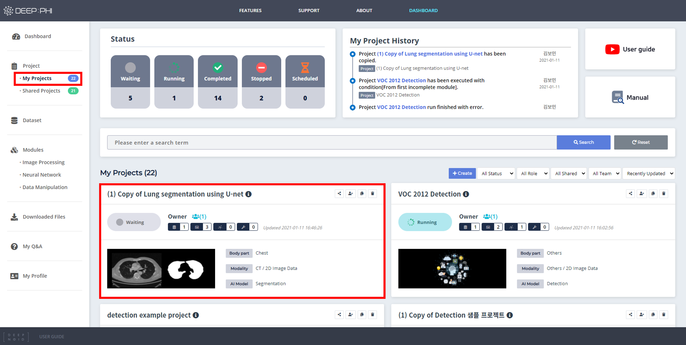

# 3. 사용 방법

***

## 3-1. 프로젝트 시작하기

프로젝트를 시작하는 방법은 두 가지가 있습니다.
직접 새로운 프로젝트를 생성해서 사용하거나, 공개된 Shared 프로젝트를 복사하여 사용할 수 있습니다.  

 

### (1) Shared 프로젝트 사용하기

Shared 프로젝트는 다른 유저가 생성하여 전체 유저에게 공개한 프로젝트입니다.  
Dashboard의 Project > Shared Projects 에서 Shared 프로젝트의 목록을 확인할 수 있습니다.

* 상단에서 이름으로 프로젝트를 검색하거나, 프로젝트를 분류별로 정렬할 수 있습니다.
* 프로젝트 이름을 클릭하면 프로젝트 내부 구성을 확인할 수 있습니다.
* 사용하고 싶은 프로젝트 우측 상단의 Copy to me 버튼을 클릭하면 My Project로 복사됩니다.
* 복사된 프로젝트에서 데이터셋만 교체하여 사용할 수도 있고, 내부 모듈을 편집하여 사용할 수도 있습니다.

 

> 복사한 프로젝트는 Project > My Projects에서 사용할 수 있습니다.

  

### (2) My 프로젝트 사용하기

사용자가 직접 프로젝트 파이프라인을 만들고 싶은 경우 My Project에서 새로운 프로젝트를 생성해 사용할 수 있습니다.  
Dashboard의 Project > My Projects 에서 +Create 버튼을 클릭하면 프로젝트 생성 마법사가 실행됩니다.

프로젝트 생성 단계는 다음과 같습니다. (*표시는 필수 입력 정보입니다.)

 

① 프로젝트의 이름과 업로드하려는 데이터셋의 촬영 부위, 영상의 종류, 요약 내용 등과 프로젝트 목표일을 입력합니다. My Project에서 각 프로젝트의 커버 이미지를 표시하고 싶은 경우 커버 이미지를 업로드하여 사용할 수 있습니다. (선택사항)

 

② 프로젝트의 연구 목적을 설명할 수 있는 상세정보를 입력합니다.

 

③ 프로젝트에서 사용하려는 AI 알고리즘의 종류를 선택합니다.

 

④ 프로젝트에 사용할 데이터셋의 차원을 선택합니다.  

* 2D 데이터셋 - X-ray와 같이 순서가 존재하지 않는 낱장의 이미지들으로 이루어진 경우  
* 3D 데이터셋 - CT나 MRI처럼 환자 단위로 연속적인 하나의 볼륨이 구성되어 각 데이터간 순서가 존재하는 경우

 

⑤ 설정을 완료하고 프로젝트를 생성합니다.

프로젝트 생성시 입력한 정보와 유사한 Shared 프로젝트가 존재하면 해당하는 프로젝트가 추천되며, 이를 이용해 프로젝트를 생성할 수 있습니다.

  

### (3) 프로젝트 모델러

프로젝트 내부로 들어오면 제일 처음 보이는 프로젝트 모델러 화면입니다.
모델링 작업 공간인 Flow workspace와 모듈 리스트, 그리고 각 모듈의 정보 등을 확인할 수 있습니다.

* 파란색 영역은 프로젝트를 동작하고 관리하는 데에 필요한 기능들이 포함되어 있습니다. Modules 탭에는 프로젝트 파이프라인을 구성하는 모듈들이 포함되어 있으며, Members, History, Deployed, Information, Settings, TODO 탭은 프로젝트의 유지 및 관리와 관련된 탭입니다.  
  -*Modules: 모듈 리스트*  
  -*Members: 프로젝트에 참여하는 멤버 관리와 채팅 기능*  
  -*History: 프로젝트 변경 이력*  
  -*Deployed: 테스트 프로젝트 버전 관리*  
  -*Information: 프로젝트 정보*  
  -*Settings: 프로젝트 실행에 사용할 자원 관리*  
  -*TODO: 스케줄과 할 일 목록 관리*

* 녹색 영역은 Flow workspace입니다. Modules 탭에서 필요한 모듈들을 드래그 & 드롭으로 가져와서 연구 파이프라인을 구성하는 공간입니다.

* 붉은색 영역은 각종 모듈의 정보를 표시하거나 파라미터를 설정하고 데이터를 시각화해서 확인할 수 있는 공간입니다.  
  -*Information: 모듈의 정보 확인*  
  -*Class: 데이터셋의 Class 정보*  
  -*Data Setting: 데이터셋 모듈의 Train/Validation/Test 데이터 비율 설정*  
  -*Parameter: Dataset 모듈을 제외한 모듈의 Parameter 설정*  
  -*Early Stopping: Neural Network 모듈의 Early stopping 설정*  
  -*Optimize: Neural Network 모듈의 Autotuning 설정*  
  -*View: 영상 확인*  
  -*Attribute: 각 데이터의 속성값(Shape, Pixel Intensity Range 등) 확인*  
  -*Processing Result: 영상의 처리 과정 확인*  
  -*Histogram Result: 데이터의 channel별 pixel 값을 histogram으로 나타냄*

* 노란색 영역에서 모듈들의 동작 로그와 파일 상태 등을 체크하고 데이터를 다운로드할 수 있으며, Neural Network 모듈의 경우 성능지표와 그래프가 시각화되어 출력됩니다.  
  -*Files: 파일 목록과 간단한 속성값을 한눈에 확인*  
  -*Log: 모듈 동작 로그*  
  -*Output: Neural Network 모듈의 학습 결과 확인*  
  -*Autotuning: Neural Network 모듈의 Auto Tuning 결과 확인*

 

좌측의 모듈 리스트에서 사용하고자 하는 모듈을 드래그하여 Flow workspace로 가져간 다음 드랍하면 데이터셋이 Flow workspace에 추가됩니다.

 

배치한 모듈 아이콘의 가운데에 커서를 두면 연결 모드가 활성화됩니다(클립모양 표시).  
클립 아이콘을 클릭한 상태에서 드래그하고 다음 모듈로 연결하면 녹색 선이 표시되고, 클릭 해제를 하면 모듈들이 화살표로 연결됩니다.