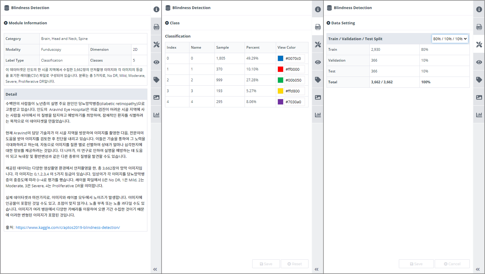

# 3. 사용 방법

***

## 3-2. Dataset 모듈

### (1) 데이터셋 업로드

DEEP:PHI에서 기본으로 제공하는 공개 데이터셋을 이용할 수도 있지만, 사용자가 직접 데이터셋을 업로드할 수도 있습니다.  

 

#### 1) 데이터셋 업로드 마법사

프로젝트 모델러 화면에서 Dataset 모듈 탭 하단의 +Create 버튼을 클릭하거나, Dashboard의 Project > My Projects 에서 +Create 버튼을 클릭하여 데이터셋을 업로드할 수 있습니다.  

 

+Create 버튼을 클릭하면 데이터셋 업로드 마법사가 실행됩니다.  

 

① 데이터셋 업로드 마법사가 실행되면, 순서를 따라 진행합니다.  
우선 데이터셋의 이름, 촬영 부위, 영상의 종류, 요약 내용 등의 필수 정보들을 입력합니다.  
필요 시 데이터셋의 대표 사진을 업로드하고, 데이터셋에 대한 상세 정보를 기술합니다.  

 

② 다음으로 데이터셋의 차원과 카테고리를 선택합니다.  
데이터셋의 차원과 카테고리를 선택하면, 하단에 가능한 폴더 구조가 표시됩니다.  
DEEP:PHI 플랫폼에서 사용하는 데이터셋은 몇 가지 고정된 폴더 구조만을 지원합니다. 업로드 폴더 구조에 대한 자세한 내용은 `4. 부록 > 4-1. 업로드 데이터셋 구조`에서 확인하실 수 있습니다.  
업로드 하고자 하는 폴더 구조를 선택하고 다음 단계로 이동합니다.  

 

③ 데이터셋 파일을 업로드합니다. 이 때 이전 단계에서 선택한 구조에 맞는 .zip 파일만 업로드가 가능합니다.  
업로드된 데이터셋들은 암호화하여 DEEP:PHI 플랫폼의 저장공간에 안전하게 저장됩니다.  
**특히 개인 정보가 담길 수 있는 Dicom 파일(.dcm 포맷)의 경우 Dicom Tag들을 비 식별화(de-identify, anonymize)한 뒤 업로드됩니다.**  
비 식별화 항목은 `4. 부록 > 4-2. Dicom 파일 비 식별화 항목`에 안내되어 있습니다.  

 

#### 2) Dataset management

 

데이터셋 업로드는 다음의 네 단계를 거쳐 진행됩니다.  
1. **Unpacking**: 사용자가 업로드한 .zip 파일의 압축을 해제합니다.  
2. **Validation**: 사용자가 업로드한 파일이 DEEP:PHI의 형식과 맞는지 검증하는 과정이 진행됩니다.  
3. **Converting**: 검증이 완료된 파일들을 실제 DEEP:PHI에서 사용 가능한 .hdf5 형태로 변환합니다.  
4. **Include in Dataset**: 실제 프로젝트에서 사용할 데이터를 선택하게 됩니다.  

 

Dataset" width="80%"/>

업로드한 데이터셋은 Dashboard의 Dataset 탭에서 확인할 수 있습니다.  
데이터셋을 클릭하면 데이터셋을 관리하는 화면인 **Dataset management** 화면으로 진입됩니다.

 

데이터셋 업로드가 완료되면 각 파일의 유효성을 검사하는 **Validation progress**가 진행됩니다.  
Dataset Management 화면에서 현재 진행중인 단계와 각 파일 별 상태를 확인할 수 있습니다.

 

Validation Progress가 모두 완료되면 **Validated** 상태로 전환되고, 각 파일의 Validation 성공 여부가 나타납니다.  
Validation이 성공한 파일들은 DEEP:PHI 전용 데이터로 전환되는 Converting 과정을 거쳐야 합니다.  
Validation이 완료된 파일들 중 원하는 파일을 선택하고, `Convert` 버튼을 눌러 Converting을 진행할 수 있습니다.  

 

Converting 과정이 모두 완료되면 **Converted files** 탭이 활성화됩니다.  
Convert가 완료된 파일들은 데이터셋에 포함하거나, 제외시킬 수 있습니다.  

원하는 파일을 선택하고 `Include in dataset` 버튼을 클릭하면 해당 파일을 데이터셋에 추가할 수 있고,  
`Exclude from dataset` 버튼을 클릭하면 해당 파일을 데이터셋에서 제거할 수 있습니다.  
혹은, `Delete` 버튼을 눌러 Converted file의 목록에서 파일을 삭제할 수도 있습니다.  

 

모든 파일을 데이터셋에 추가해 보겠습니다.  
데이터셋에 파일이 추가되면 **Files Included in Dataset** 탭이 활성화됩니다.  

해당 탭에서 데이터셋에 포함된 파일들을 확인할 수 있고,  
불필요한 파일들은 데이터셋 목록에서 제외시킬 수 있습니다.  

  

### (2) 업로드한 데이터셋 관리하기

Dashboard의 Dataset에서 데이터셋을 관리할 수 있습니다.  

* 모두에게 공개된 Shared 데이터셋과 사용자가 직접 업로드한 My 데이터셋을 관리할 수 있습니다.  
* 다양한 검색 옵션을 조정하여 원하는 데이터셋을 찾을 수 있습니다.  
* 데이터셋을 클릭하면 Dataset management 화면으로 전환되며, 데이터셋의 정보를 수정하거나 파일을 추가/제거할 수 있습니다.  

  

### (3) Dataset 모듈 사용하기

Dataset 모듈은 사용자가 직접 업로드한 My 데이터셋과 딥노이드에서 공유하고 있는 Shared 데이터셋으로 구성되어 있습니다. 데이터셋은 촬영 부위 별로 구분되어 있어 각 카테고리에서 데이터셋을 찾거나, 검색창을 이용해 필요한 데이터셋을 찾을 수 있습니다.

 

- 데이터셋은 촬영 부위별로 구분되어 있습니다.  
- 사용자가 직접 업로드한 데이터셋은 데이터셋 모듈 이름 좌측에 `My` 태그가 표시되어 있습니다.  

 

- 중앙 하단에서 데이터셋에 포함된 파일 목록을 확인할 수 있습니다.
- 우측 영역에서 해당 모듈의 정보와 각 영상을 확인하고, 파라미터를 설정할 수 있습니다.

 

Dataset 모듈은 총 7개의 메뉴를 이용할 수 있습니다.

- 위 3개 메뉴는 데이터셋 전체에 적용되는 메뉴입니다.  
  -*Information: 모듈 상세설명*  
  -*Class: 데이터셋의 Class 정보*  
  -*Data Setting: Test/Validation/Train에 사용할 데이터셋의 비율 설정*

- 아래 4개 메뉴는 하단 Files 탭에서 선택한 데이터에 해당되는 메뉴입니다.  
  -*View: 선택한 데이터의 영상*  
  -*Attribute: 선택한 데이터의 Shape, Pixel Intensity Range 등의 속성값*  
  -*Processing Result: 선택한 영상의 처리 과정*  
  -*Histogram Result: 선택한 데이터의 channel별 pixel 값의 histogram*
