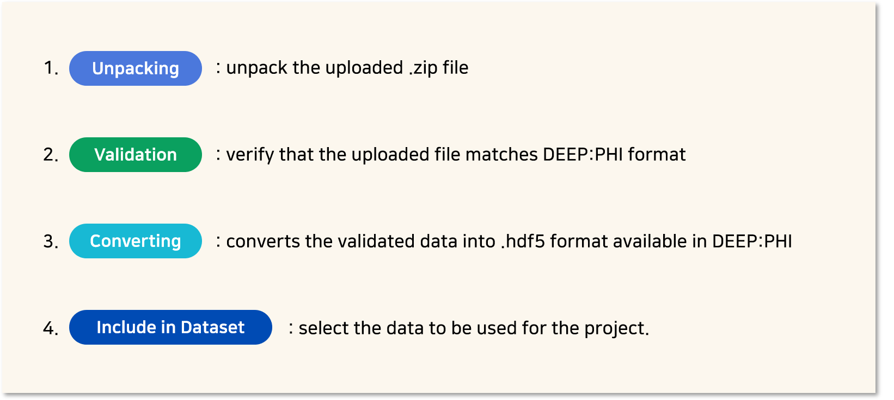
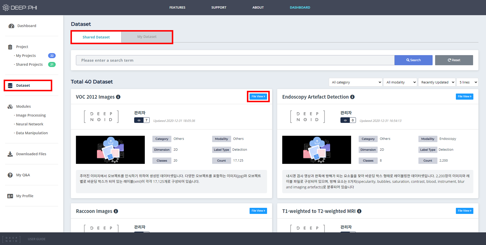

# 3. 사용 방법

***

## 3-2. 데이터셋 업로드 및 관리하기

### 1) 데이터셋 업로드

프로젝트를 생성했으면 이제 해당 프로젝트에서 사용할 데이터셋을 업로드할 수 있습니다.  
프로젝트 모델러 화면의 좌측 메뉴에서 Dataset을 선택하고 하단의 Create 버튼을 누르면 업로드 생성 마법사가 실행되며 간단한 정보를 입력하여 데이터셋을 모듈로 생성할 수 있습니다.  
데이터셋 모듈의 생성 단계는 아래와 같습니다. (*표시는 필수 입력 정보입니다.)

 

> ① 데이터셋 업로드 마법사가 처음 실행되는 화면에서는 데이터셋 업로드 방법에 대한 튜토리얼 영상을 볼 수 있습니다.  
> DEEP:PHI 플랫폼에서 사용하는 데이터셋은 몇 가지 고정된 폴더 구조만을 지원하기 때문에 데이터셋 업로드 전 꼭 튜토리얼 영상을 시청하시는 것을 권해드립니다.  
> 업로드 폴더 구조에 대한 자세한 내용은 4. 부록의 4-1. 업로드 데이터셋 구조를 확인해 주세요.

> ② 튜토리얼 다음 단계에선 프로젝트 생성 마법사와 유사한 형태로 데이터셋 모듈에 대한 정보들을 입력할 수 있습니다.  
> 데이터셋의 촬영 부위, 영상의 종류, 요약 내용 등을 입력하고 데이터셋의 커버 이미지를 표시하고 싶은 경우 선택적으로 커버 이미지를 업로드하여 사용할 수 있습니다.

> ③ 해당 데이터셋에 대한 상세정보를 입력합니다.

> ④ 4. 부록의 4-1. 업로드 데이터셋 구조대로 데이터셋이 준비되었다면 해당 폴더 전체를 압축한 압축파일을 업로드할 수 있습니다.  
> 우측 하단의 Browse 버튼을 눌러 파일 탐색기를 통해 압축파일을 업로드할 수 있습니다.  
> 업로드된 데이터셋들은 암호화하여 DEEP:PHI 플랫폼의 클라우드 저장공간에 안전하게 저장됩니다.  
> 특히 개인 정보가 담길 수 있는 Dicom 파일(.dcm 포맷)의 경우 Dicom Tag들을 비 식별화(de-identify, anonymize)한 뒤 업로드됩니다.  
> 비 식별화 항목은 4. 부록의 4-2. Dicom 파일 비 식별화 항목에 안내되어 있습니다.

> ⑤ 모든 설정을 완료하고 데이터셋 업로드를 시작하면 상태 창을 통해 업로드 상태를 확인할 수 있습니다.  
> 그리고 Minimize Windows를 클릭하면 백그라운드에서 업로드 작업을 수행하기 때문에 데이터 업로드 중에도 다른 작업을 수행할 수 있습니다.

  

### 2) 데이터셋 관리하기

데이터셋은 프로젝트 바깥의 Dashboard에서 관리할 수 있습니다.  
Dashboard 좌측 메뉴의 Dataset 메뉴를 선택하면 딥노이드에서 공유하거나 타 사용자가 공유한 Shared 데이터셋과 사용자가 직접 업로드한 My 데이터셋을 관리할 수 있습니다.  
관리 페이지에서도 데이터셋 업로드를 수행할 수 있습니다. 관리 페이지에서 업로드한 데이터셋 역시 프로젝트 내에서 데이터셋 모듈로 사용할 수 있습니다.  

 

> * 데이터셋 관리 페이지 좌측 상단에서 Shared 데이터셋과 My 데이터셋을 확인할 수 있습니다.  
> * 데이터셋 관리 페이지 우측 상단에서 Upload Dataset 버튼을 눌러 데이터셋을 업로드할 수 있습니다.  
> * 중앙 영역에서 각 데이터셋이 표시됩니다. Detail info를 눌러 데이터셋 업로드 시 입력한 상세정보를 확인할 수 있으며 File View 버튼을 눌러 업로드한 파일을 확인할 수 있습니다.  
> * 데이터셋이 업로드 구조 규칙과 맞지 않거나 데이터셋에 잘못된 파일이 존재하는 경우 해당 데이터셋 영역의 우측 상단에 Error 표시가 출력됩니다.