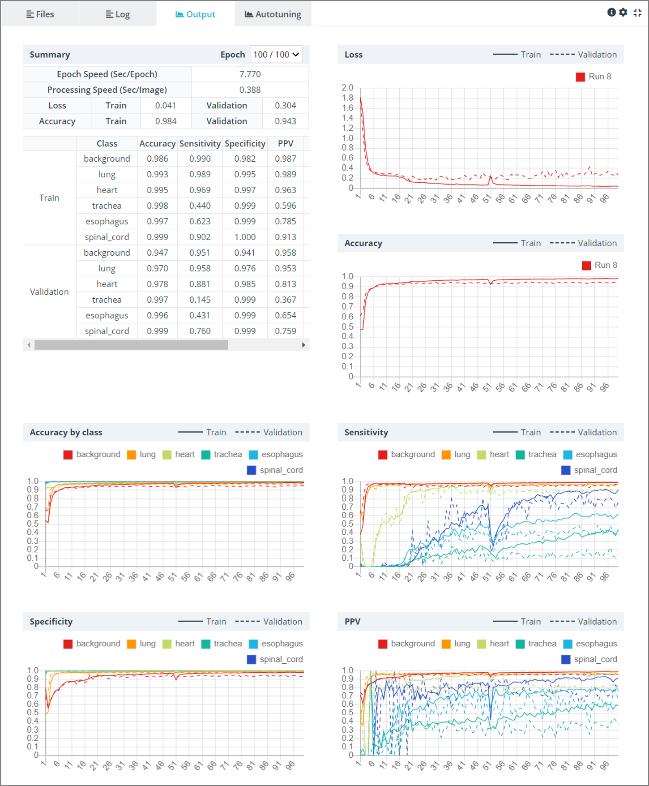
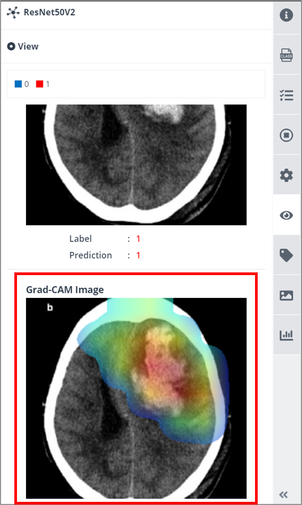

# 3. 사용 방법

***

## 3-6. 부가 기능

DEEP:PHI 플랫폼은 사용자 편의성 증대를 위해 다양한 부가기능을 제공하고 있습니다.  

연구 편의성 증대를 위해 다양한 사용자들을 내 프로젝트에 초대하고 특별하게 제작한 Image Processing 모듈과 Neural Network 모듈을 다른 사용자들에게 공유하고, 내 프로젝트 파이프라인을 다른 사용자에게 공유할 수 있습니다.  
그리고 연구 결과를 논문과 같은 산출물로 제작하기 편리하도록 원본 데이터셋부터 각 모듈의 결과 이미지, 그리고 프로젝트 파이프라인의 스크린샷 캡쳐 기능을 포함한 다양한 종류의 데이터 다운로드 기능을 제공합니다.

### (1) 프로젝트 공동연구

프로젝트 내부에서 좌측 Members 탭을 클릭하면 현재 프로젝트의 구성원을 확인할 수 있습니다.  
각 구성원 별 권한을 관리하려면 `Setting`을, 구성원을 추가하려면 `Invite` 버튼을 눌러 구성원을 추가할 수 있습니다.

프로젝트 구성원을 추가하는 경우 해당 사용자의 DEEP:PHI 플랫폼 계정(이메일 주소), 프로젝트 내에서의 역할과 초대 메시지를 입력하고 `Invite`를 누르면 해당 사용자에게 초대장이 발송됩니다.

기존 구성원에 대해 권한 편집을 수행하려면 `Setting`의 Role에서 올바른 역할을 부여할 수 있습니다. 또한 구성원을 제거하려는 경우 `Delete` 버튼을 누르면 구성원이 제거됩니다.

### (2) 데이터 다운로드

DEEP:PHI 플랫폼의 각 모듈은 입/출력 데이터를 jpeg 이미지 파일로 다운로드할 수 있습니다.

위 이미지와 같이 중앙 하단 우측의 `Download` 버튼을 누르면 다운로드 창이 팝업됩니다. 각 모듈의 입/출력 데이터를 전체 다운로드하거나, 파일 리스트에서 필요한 파일들만 선택하여 다운로드할 수 있습니다.

다운로드 버튼 우측의 점버튼을 클릭하는 경우 전체 다운로드를 선택할 수 있습니다. 전체 다운로드는 별도의 파일 리스트 체크가 필요 없이 해당 모듈을 거친 데이터 전체가 다운로드 됩니다.

원하는 파일만 다운로드하려는 경우 파일 리스트에서 위 이미지처럼 체크박스에 원하는 파일들을 골라 체크 표시를 하고 Download 버튼을 누르면 됩니다.

각 모듈에서 다운로드 가능한 파일들은 Input 데이터(Data Files)와 Label 데이터(Label Files)를 받을 수 있으며 신경망 모듈의 경우 신경망을 거쳐 예측된 결과(Prediction Files)를 추가로 다운로드할 수 있습니다. 위 선택 창에서 필요한 데이터만 선택하여 다운로드할 수 있습니다.

설정을 마치고 `Download` 버튼을 누르면 우측 하단에 결과 메시지가 팝업 됩니다.

파일 크기가 클 경우 압축이 진행되고 백그라운드에서 작업이 수행됩니다. `OK` 버튼을 누르면 프로젝트 내에서 계속 작업을 수행할 수 있으며 `Go to download page now` 버튼을 누르면 Dashboard의 Download 메뉴로 이동합니다.

백그라운드에서 작업된 다운로드 요청은 Dashboard의 Download 메뉴에서 확인 가능합니다.

백그라운드에서 압축 작업이 수행 중이면 우측에 진행률이 표시 됩니다.  
압축 작업이 완료되어 다운로드가 가능해지면 위 이미지와 같이 우측에 Download 버튼이 활성화됩니다.  
활성화된 다운로드 링크는 만료 기간이 존재하며 만료 기간 이후엔 다운로드할 수 없습니다.

기한이 만료되고 나서 파일 다운로드를 수행하려면 다시 프로젝트 내부에서 다운로드를 요청해야 합니다.

### (3) 테스트 프로젝트

학습이 완료되서 성능이 충분하다고 판단되는 프로젝트는 테스트 프로젝트로 전환할 수 있습니다.  

테스트 프로젝트는 학습이 완료된 프로젝트에서 테스트 프로젝트를 생성할 수 있는데, 이 시점의 파이프라인과 각 모듈의 설정 상태 등을 그대로 고정시켜 inference만을 수행하게 합니다.  
이러한 테스트 프로젝트는 추후 공개될 DEEP:STORE을 통해 영상 판독을 수행하는 inference 앱의 형태로 배포될 수 있습니다.  
같은 프로젝트 내에서 다수의 테스트 프로젝트가 존재할 수 있으며 각각의 테스트 프로젝트는 버전 관리를 통해 별개의 테스트 프로젝트로 관리됩니다.

학습이 완료된 프로젝트 내부에서 위 이미지처럼 좌측 탭의 Deployed 탭을 선택하여 `+Create`를 클릭하거나 상단 바의 좌측에 존재하는 Train / Test 버튼을 클릭하여 Train 프로젝트에서 Test 프로젝트로 활성화를 하면 테스트 프로젝트를 생성하는 생성 마법사가 팝업 됩니다.

테스트 프로젝트의 이름과 버전을 입력한 뒤 저장할 신경망의 종류를 선택하고 `Next`를 클릭해서 다음 단계를 진행합니다.  
다음 단계에선 Test를 수행할 때 각 클래스 별로 특정 수치 이상인 데이터들을 알람으로 알려주기 위한 threshold value를 입력하게 됩니다.

위 이미지처럼 각 클래스의 threshold value를 0.5라고 하는 경우 cat class로 예측된 결과의 확률이 0.5 이상인 경우 해당 데이터가 50% 이상의 확률로 cat class라는 알림이 표시됩니다.  
해당 값을 설정하고 `Next`를 누르면 다음 단계로 진행이 됩니다.

이 단계에선 동일한 프로젝트 파이프라인 내에서 각 모듈의 설정값만 바꾸면서 학습을 반복적으로 수행하는 실험을 수행한 경우 최적 성능의 설정값을 선택할 수 있도록 사용자에게 도움을 제공합니다.  

정확도(Accuracy)를 중점적으로 판단할 것인지, 손실 값(Loss)을 중점적으로 판단할 것인지, NPV나 PPV를 판단 기준으로 삼을 것인지 사용자의 판단에 따라 학습된 신경망을 선택합니다. 각 성능 수치를 클릭했을 때 하늘색으로 표시되는 영역이 같은 신경망입니다.  

하얀색 영역을 클릭하면 다른 신경망이 선택됩니다. 따라서 이를 이용하여 최적의 성능 수치라고 판단되는 성능을 클릭해서 해당 신경망을 배포하여 테스트 프로젝트를 구성하게 됩니다.  

선택이 완료되었다면 `Next`를 눌러 다음 단계를 진행합니다.

마지막 단계에선 이전 단계에서 선택한 신경망의 학습 단계(Epoch)와 그 성능 수치를 표시해 줍니다.  

최종적으로 해당 신경망의 성능을 배포해도 된다는 확신이 든다면 `OK` 버튼을 눌러 배포를 완료합니다.

배포된 테스트 프로젝트로 진입하면 화면은 위와 같습니다.  
좌측 Deployed 탭에선 배포된 프로젝트에 대한 버전 정보와 기타 성능 정보를 확인할 수 있습니다.
