# 4. 부록

***

## 4-1. 데이터셋 템플릿

### (1) Classification 데이터셋 구조

#### Classification Case 1

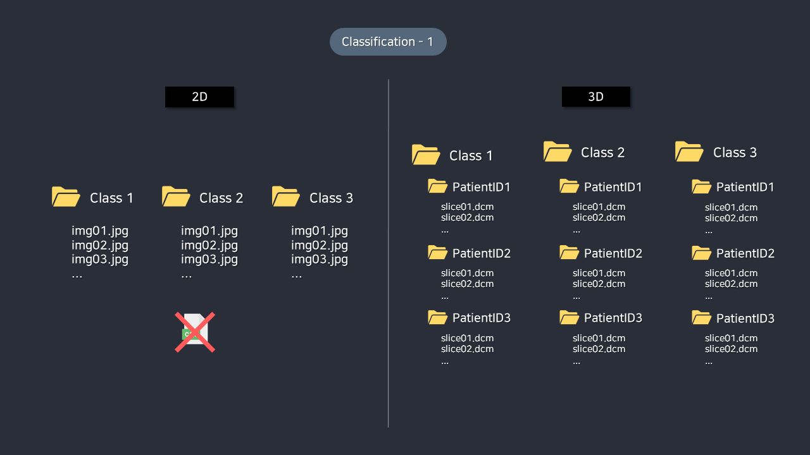

- 영상 데이터는 클래스 별로 구분된 폴더 아래에 존재합니다. (Datset/Label 폴더 없음) 
- 이 경우 영상 데이터의 경로에 클래스명이 존재하므로 별도의 클래스 정보가 필요하지 않습니다.  
- 3D형 데이터의 경우 각 클래스 폴더 아래에 개별 Patient로 구분된 하위 폴더가 존재하고 그 안에 각각의 영상 데이터가 존재해야 합니다.  
- 영상 데이터의 상위 폴더에 클래스명이 존재하므로 별도의 클래스 정보가 필요하지 않습니다.

#### Classification Case 2

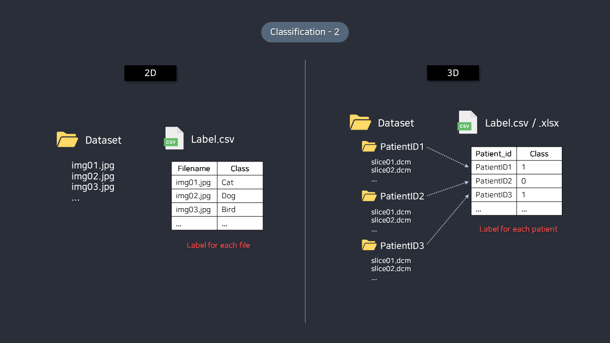

- 영상 데이터는 Dataset 폴더 하위에 전부 존재합니다.  
- 3D 데이터의 경우 영상 데이터는 Dataset 폴더 하위에 각 환자별로 폴더가 구분되어 있어야 합니다.
- 라벨 데이터의 경우 각 파일별로 해당 파일이 어떤 클래스인지 표시되어 있는 csv 파일이 별도로 필요합니다.  
- Csv 파일의 각 row는 filename과 class로 구분되어 있어야 합니다.
- 3D 데이터의 경우 filename 대신 patient id가 사용됩니다.

  

### (2) Segmentation 데이터셋 구조

#### Segmentation Case 1

  
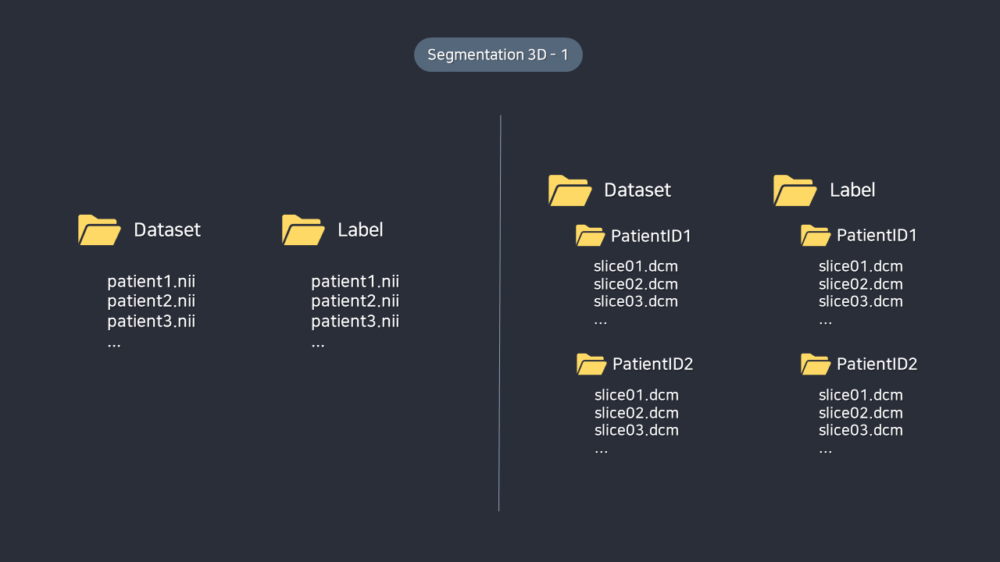

- 영상 데이터와 라벨 데이터가 각각 Dataset 폴더와 Label 폴더 하위에 존재합니다.  
- 영상 데이터와 라벨 데이터의 파일명은 동일해야 합니다.  
- 3D형 데이터의 경우 하나의 .nii 혹은 .nii.gz 형태의 NIFTI 파일로 되어 있거나, 각 slice가 별개의 파일로 구성될 수 있습니다.

#### Segmentation Case 2

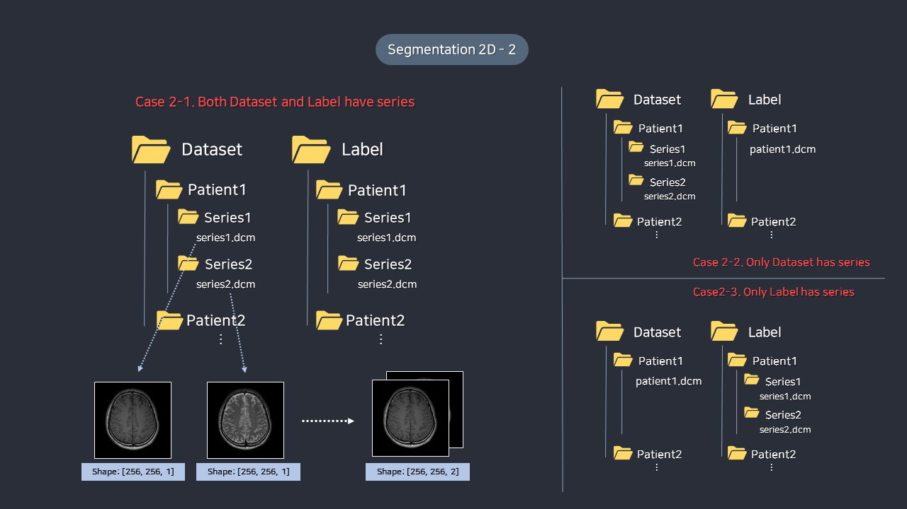  
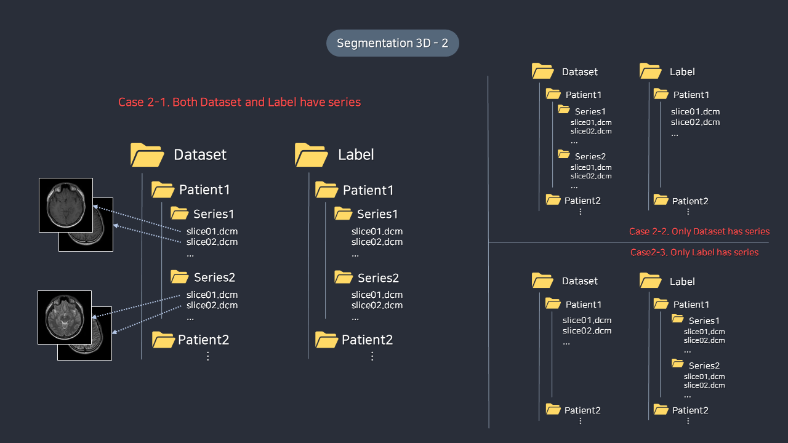

- 영상 데이터와 라벨 데이터가 각각 Dataset 폴더와 Label 폴더에 존재하며, 각 Series Instance UID 별로 폴더가 구분이 되어있는 경우입니다. 
- 영상 데이터 혹은 라벨 데이터만 Series로 구분되어 있을 수도 있고, 영상 데이터와 라벨 데이터 모두 Series로 구분되어 있을 수도 있습니다. 
- 영상 데이터와 라벨 데이터의 파일명은 동일해야 합니다.
- 3D형 데이터의 경우 하나의 .nii 혹은 .nii.gz 형태의 NIFTI 파일로 되어 있거나, 각 slice가 별개의 파일로 구성될 수 있습니다.

#### Segmentation Case 3

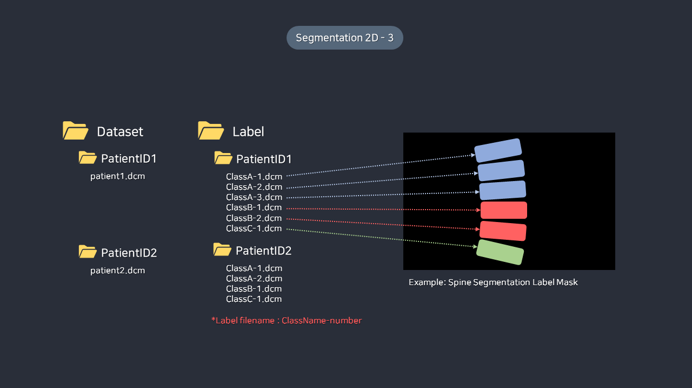  

- 다수의 Label 파일이 존재하는 경우 Dataset 폴더와 Label 폴더 하위에 Patient 별로 폴더를 생성해 줍니다.
- Label 폴더 하위의 Patient 폴더에 복수의 라벨 데이터가 들어갑니다.
- 라벨 데이터의 파일명은 반드시 "클래스명-번호.확장자"로 만들어 주세요.
- 3D형 데이터의 경우 하나의 .nii 혹은 .nii.gz 형태의 NIFTI 파일만 가능합니다.

  

### (3) Detection 데이터셋 구조

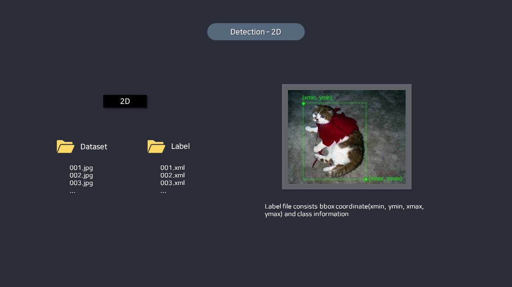  
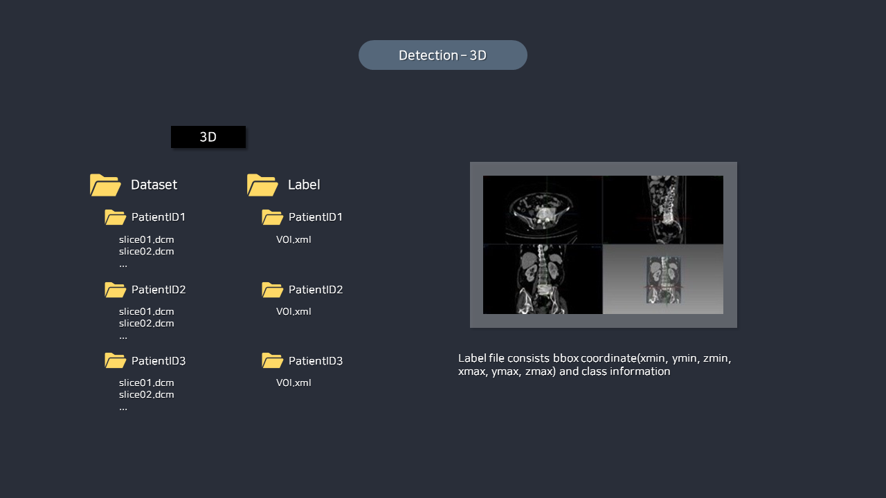

- 라벨 파일에 class 정보와 bbox 정보(xmin, ymin, xmax, ymax)가 포함되어 있어야 합니다.

  

### (4) Transformation 데이터셋 구조

#### Transformation Case 1

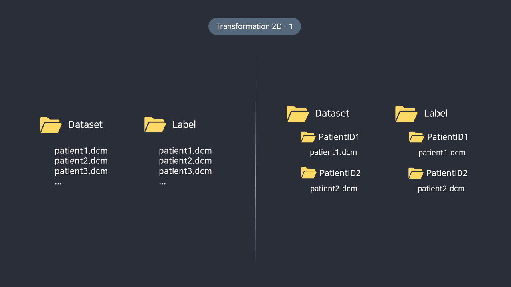  
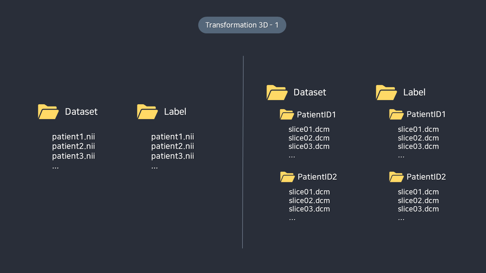

- 영상 데이터와 라벨 데이터가 각각 Dataset 폴더와 Label 폴더 하위에 존재합니다.  
- 영상 데이터와 라벨 데이터의 파일명은 동일해야 합니다.  
- 3D형 데이터의 경우 하나의 .nii 혹은 .nii.gz 형태의 NIFTI 파일로 되어 있거나, 각 slice가 별개의 파일로 구성될 수 있습니다.

#### Transformation Case 2

  
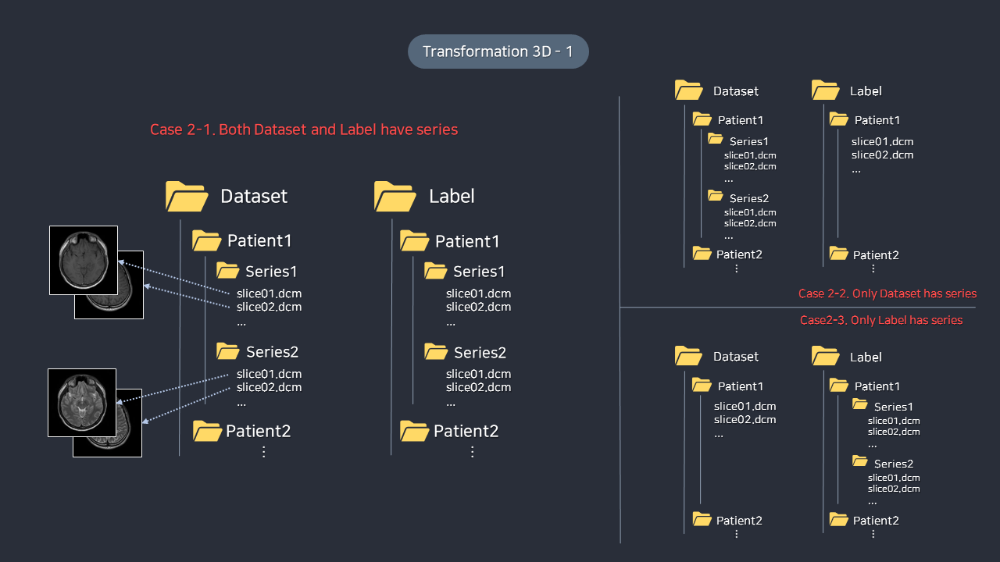

- 영상 데이터와 라벨 데이터가 각각 Dataset 폴더와 Label 폴더에 존재하며, 각 Series Instance UID 별로 폴더가 구분이 되어있는 경우입니다. 
- 영상 데이터 혹은 라벨 데이터만 Series로 구분되어 있을 수도 있고, 영상 데이터와 라벨 데이터 모두 Series로 구분되어 있을 수도 있습니다. 
- 영상 데이터와 라벨 데이터의 파일명은 동일해야 합니다.
- 3D형 데이터의 경우 하나의 .nii 혹은 .nii.gz 형태의 NIFTI 파일로 되어 있거나, 각 slice가 별개의 파일로 구성될 수 있습니다.